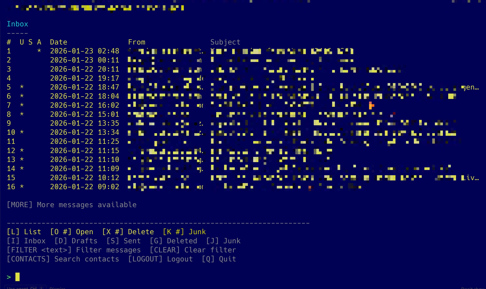

# psmail - PowerShell Console Mail Client

A draft-first console email client for **Outlook.com** and **Microsoft 365** accounts
using **Microsoft Graph API**.



## Features

- **Draft-first workflow**: All new emails are created as drafts first
- **nvim integration**: Compose and edit emails in Neovim
- **Microsoft Graph**: Modern API for Outlook.com
- **Reply & Forward**: Reply, Reply All, and Forward with quoted text
- **Attachments**: Upload files when composing, save received attachments
- **Contact search**: Search and copy email addresses from your email history
- **Paging**: Long emails are displayed page by page
- **HTML cleanup**: Automatic conversion of HTML emails to clean text
- **S/MIME support**: Detect and verify signed emails (Phase 1: detection
  stubs, Phase 2: full verification, Phase 3: signing/encryption)
- **Folder management**: Inbox, Drafts, Sent, Deleted, Junk
- **Session management**: Stay logged in or logout to switch accounts
- **Text-only**: Clean, distraction-free email composition
- **No local sync**: All operations are server-side

## Requirements

- **PowerShell 7+** (pwsh)
- **Neovim** (nvim) installed and in PATH
- **Microsoft Graph Authentication module** (auto-installed on first run)
- **Microsoft account** (Outlook.com, Hotmail.com, or Microsoft 365/office.com)

## Installation

1. Clone or download this repository
2. Ensure PowerShell 7+ is installed:
   ```powershell
   pwsh --version
   ```
3. Ensure nvim is installed:
   ```powershell
   nvim --version
   ```
4. Navigate to the project directory

## Usage

### Start psmail

```powershell
pwsh psmail.ps1
```

On first run, you will be prompted to:
- Install Microsoft.Graph.Authentication module (if not present)
- Sign in to your Microsoft account via browser
- Grant permissions (Mail.ReadWrite, Mail.Send, User.Read)

### Commands

#### Global Navigation
- `I` - Switch to Inbox
- `D` - Switch to Drafts
- `S` - Switch to Sent
- `G` - Switch to Deleted (formerly Trash)
- `J` - Switch to Junk (Spam)
- `CONTACTS` - Search contacts and copy email address
- `LOGOUT` - Disconnect and clear session (to switch accounts)
- `Q` - Quit (keeps session active)

#### Common Commands
- `L` - List/refresh current folder
- `R <#>` - Read message by number
- `M` - Load next page of messages
- `FILTER <suchtext>` - Filter messages by search term (searches From, Subject, Body)
- `CLEAR` - Remove active filter

#### Inbox
- `X <#>` or `X <#-#>` - Delete message(s) (move to Deleted)
- `K <#>` or `K <#-#>` - Mark as Junk

#### Drafts
- `NEW` - Create new draft
- `E <#>` - Edit existing draft
- `SEND <#>` - Send draft
- `X <#>` or `X <#-#>` - Delete draft(s)

#### Sent
- `R <#>` - Read sent message
- `REDRAFT <#>` - Copy to drafts for resending (includes recipients and attachments)
- `X <#>` or `X <#-#>` - Delete sent message(s) (move to Deleted)

#### Deleted
- `RESTORE <#>` or `RESTORE <#-#>` - Move back to Inbox
- `PURGE <#>` or `PURGE <#-#>` - Delete permanently (only available in Deleted folder)

#### Junk
- `INBOX <#>` or `INBOX <#-#>` - Move to Inbox (mark as not junk)
- `X <#>` or `X <#-#>` - Delete (move to Deleted)

#### When Viewing a Message
- `REPLY` - Reply to sender
- `REPLYALL` - Reply to all recipients
- `FORWARD` - Forward message
- `ATT` - List attachments
- `SAVE <#>` - Save specific attachment
- `SAVEALL` - Save all non-inline attachments

### Bulk Operations (Range Support)

Many commands support bulk operations using various input formats:

**Single message:**
```
> X 3
```
Deletes message #3

**Range of messages:**
```
> X 2-5
```
Deletes messages #2, #3, #4, and #5

**Reversed range (automatic correction):**
```
> X 5-2
```
Same as `X 2-5` - automatically sorts the range

**Comma-separated list:**
```
> X 3,1,5
```
Deletes messages #1, #3, and #5 (automatically sorted and deduplicated)

**Mixed ranges and lists:**
```
> X 1,3-5,7
```
Deletes messages #1, #3, #4, #5, and #7

**With spaces (optional):**
```
> X 3, 1, 5
```
Spaces around commas are automatically handled

**Duplicate handling:**
```
> X 3,5,3,1
```
Duplicates are automatically removed - deletes #1, #3, #5

**Commands supporting bulk operations:**
- `X` - Delete/move to deleted (not available in Deleted folder)
- `K` - Move to Junk (from Inbox only)
- `INBOX` - Move to Inbox (from Junk only)
- `RESTORE` - Restore from Deleted (Deleted folder only)
- `PURGE` - Permanently delete (Deleted folder only)

**Confirmation:**
All bulk operations show a list of affected messages and require confirmation before proceeding.

### Contact Search
- `CONTACTS` - Search your email history for contacts
- Enter search term or press Enter for all
- Select number to copy email address to clipboard

## Message Filtering

The filter feature allows you to search and filter emails in all folders (Inbox, Drafts, Sent, Deleted, Junk).

### Using Filters

**Activate a filter:**
```
> FILTER john
```
Shows only emails containing "john" in the sender (email address and name), subject, or body.

**Remove filter:**
```
> CLEAR
```
Displays all emails again.

### Filter Behavior

- **Search is case-insensitive**: Ignores uppercase/lowercase
- **Substring matching**: Finds partial matches
- **Multi-field search**: Searches From, Subject, and Body simultaneously
- **Filter indicator**: Active filters are displayed in yellow above the message list: `[Filter active: 'searchtext']`
- **Pagination works with filters**: Use `M` to load additional filtered results
- **Persistent across folders**: Filters remain active when switching between folders (Inbox, Drafts, Sent, Deleted, Junk)
- **Manual clearing required**: Use `CLEAR` to remove the active filter

### Performance

- Loads only enough emails to fill the visible list
- Processes emails in batches of 50 for large mailboxes
- Maximum 10 batches searched to avoid excessive API calls
- Uses client-side filtering (Microsoft Graph API doesn't support body content filtering)

## Email Composition

### Creating a Draft

1. Switch to Drafts folder: `D`
2. Create new draft: `NEW`
3. Neovim opens with template:

```
To: 
Subject: 
Attachments: 

---

```

4. Fill in recipients (comma or semicolon separated)
5. Add subject
6. **Optional**: Add attachment paths (comma-separated, supports `~` and relative paths)
7. Write message body below `---` separator
8. Save and quit (`:wq`)
9. Footer is automatically appended on first save
10. Attachments are validated and uploaded automatically

### Editing a Draft

1. In Drafts folder, run: `E <number>`
2. Edit in Neovim
3. Save changes (`:wq`) or cancel (`:q!`)

### Sending

1. In Drafts folder: `SEND <number>`
2. Confirm when prompted
3. Message is sent and moved to Sent Items

### Redrafting Sent Messages

You can copy a sent message back to drafts for resending:

1. Switch to Sent folder: `S`
2. Run: `REDRAFT <number>`
3. A new draft is created with:
   - Subject prefixed with `Fwd:`
   - Original message body
   - All recipients (To, CC, BCC)
   - All attachments copied
4. Switch to Drafts (`D`) to edit or send the new draft

### Attachments

You can attach files when composing emails:

```
Attachments: ~/Desktop/report.pdf, image.png, C:\path\to\file.zip
```

- Supports absolute paths, relative paths, and `~` (home directory)
- Multiple files separated by comma or semicolon
- Files are validated before the draft is created
- Attachments are saved to `attachments/` folder when downloading
- Duplicate filenames get numbered: `file (1).pdf`, `file (2).pdf`

### Footer

The file `data/footer.txt` contains your email signature. It is automatically
appended to new drafts. Edit this file to customize your signature.

### HTML Footer with Logo

You can optionally use an HTML footer with an embedded logo. When `data/footer.html` exists, all emails are automatically sent as HTML instead of plain text.

**Create an HTML footer:**

```powershell
.\tools\Create-HtmlFooter.ps1 `
    -Name "Your Name" `
    -Title "Your Title" `
    -Email "your@email.com" `
    -Website "https://yourwebsite.com" `
    -LogoPath "path\to\logo.png"
```

**Features:**
- Rich text footer with formatting and links
- Inline logo embedded as data URI (no separate attachment)
- Automatic conversion: your plain text from neovim → HTML email
- Compatible with all major email clients (Outlook, Gmail, Apple Mail, etc.)

**Logo guidelines:**
- Format: PNG (recommended) or JPG
- Size: Under 50 KB (warns if over 100 KB)
- Dimensions: 120-200 pixels wide

**Switch back to plain text:**
```powershell
Remove-Item data\footer.html
```

For detailed instructions and customization options, see `tools/README.md`.

## Message List Format

### Inbox

```
#  U S A  Date               From              Subject
1  * ✔ *  2026-01-22 12:30   alice@x.de        Signed mail with attachment
2    ~    2026-01-22 11:10   bob@y.de          Untrusted sig
3    ✖    2026-01-22 10:40   eve@z.de          Broken sig
4         2026-01-22 09:00   carl@k.de         Normal mail
```

**Columns:**
- `#` - Message number
- `U` - Unread indicator (`*` = unread)
- `S` - S/MIME signature status (Inbox only):
  - `✔` - Signed and trusted
  - `~` - Signed, untrusted (chain issue or revocation unavailable)
  - `✖` - Signed, invalid (broken signature or expired certificate)
  - ` ` (blank) - Not signed
- `A` - Attachment indicator (`*` = has attachments)

### Other Folders

Similar format without S/MIME column (S/MIME verification only in Inbox).

## S/MIME Behavior

### Phase 1 (Current)
- **Detection stubs**: Infrastructure in place, always returns "None"
- **UI ready**: List view shows signature icons, message view shows details

### Phase 2 (Future)
- **Full verification**: 
  - Detect `multipart/signed` or `application/pkcs7-mime`
  - Verify signatures using .NET `SignedCms`
  - Validate certificate chains against Windows root store
  - Display signer information (name, issuer, validity)
  - Handle revocation checking with online fallback

### Phase 3 (Future)
- **Signing**: Sign outgoing messages with certificate from Windows store
- **Encryption**: Encrypt messages using recipient certificates
- **Combined**: Sign and encrypt in one operation

## File Structure

```
psmail.ps1              # Main entry point
src/
  config.ps1            # Configuration and constants
  state.ps1             # Global state management
  util.ps1              # Formatting and utility functions
  auth.ps1              # Microsoft Graph authentication
  graph.ps1             # Graph API REST helpers
  ui.ps1                # Menu rendering and input
  mail_list.ps1         # Folder listing logic
  mail_read.ps1         # Message reading and display
  drafts.ps1            # Draft lifecycle and attachment upload
  editor.ps1            # nvim integration
  attachments.ps1       # Attachment download/save logic
  contacts.ps1          # Contact search from email history
  smime.ps1             # S/MIME detection and verification
tools/
  Create-HtmlFooter.ps1 # Generate HTML footer with logo
  README.md             # HTML footer documentation
attachments/            # Downloaded attachments (ignored by git)
data/
  footer.txt            # Email signature footer (plain text)
  footer.html           # HTML footer with logo (optional)
```

## Configuration

### Custom Editor

To use a different editor, edit `src/config.ps1`:

```powershell
Editor = "notepad"  # or "code", "vim", etc.
```

### Page Size

Change number of messages per page in `src/config.ps1`:

```powershell
PageSize = 50  # Default is 20
```

### Color Scheme

All colors used in the UI are configurable in `src/config.ps1`. You can customize the color scheme by modifying the `Colors` section:

```powershell
Colors = @{
    # Headers and titles
    Header          = "Cyan"        # Main headers and separators
    Separator       = "DarkGray"    # Separator lines
    
    # Messages and status
    Success         = "Green"       # Success messages
    Error           = "Red"         # Error messages
    Warning         = "Yellow"      # Warning messages
    Info            = "DarkGray"    # Info messages
    
    # List display
    SubjectHeader   = "DarkGray"    # Column headers in message lists
    FilterActive    = "Yellow"      # Active filter indicator
    NoMessages      = "DarkGray"    # "No messages" text
    LoadingMore     = "Cyan"        # Loading/progress messages
    
    # Menu and prompts
    MenuAction      = "Yellow"      # Menu action items
    MenuGlobal      = "DarkGray"    # Global navigation menu
    Prompt          = "Green"       # Command prompt
    
    # Message details
    MessageDetail   = "Cyan"        # Message details in confirmations
    FieldLabel      = "DarkGray"    # Field labels (From, To, Subject, etc.)
    
    # Confirmations
    ConfirmWarning  = "Yellow"      # Regular confirmation prompts
    ConfirmDanger   = "Red"         # Dangerous action prompts (e.g. PURGE)
}
```

Supported color values: `Black`, `DarkBlue`, `DarkGreen`, `DarkCyan`, `DarkRed`, `DarkMagenta`, `DarkYellow`, `Gray`, `DarkGray`, `Blue`, `Green`, `Cyan`, `Red`, `Magenta`, `Yellow`, `White`

## Authentication & Permissions

psmail uses **device code flow** authentication via Microsoft Graph. On first
run:

1. A browser opens for login
2. You sign in with your Microsoft account (consumer or work/school)
3. You grant the following permissions:
   - `Mail.ReadWrite` - Read and write mail
   - `Mail.Send` - Send mail
   - `User.Read` - Read user profile
   - `People.Read` - Access contacts (may not work on all consumer accounts)
   - `Contacts.Read` - Access contacts (fallback)

Credentials are cached by Windows Web Account Manager (WAM) for faster
re-authentication.

## Limitations

- **Text-only composition** (no HTML)
- **No inline images on send** (can receive and save them)
- **No POP/IMAP**
- **No background sync**
- **No full TUI widgets** (command-line interface only)

## Troubleshooting

### Module installation fails
Run PowerShell as Administrator and manually install:
```powershell
Install-Module Microsoft.Graph.Authentication -Scope CurrentUser -Force
```

### nvim not found
Ensure Neovim is installed and in PATH:
```powershell
$env:PATH += ";C:\Program Files\Neovim\bin"
```

### Authentication fails
Try clearing cached credentials:
```powershell
Disconnect-MgGraph
```
Then restart psmail.

### Graph API errors
Check your internet connection and Microsoft service status.

## License

This is a demonstration project for educational purposes.

## Credits

Built with:
- Microsoft Graph API
- PowerShell 7
- Neovim

---

**psmail** - Simple, draft-first email for the command line.
