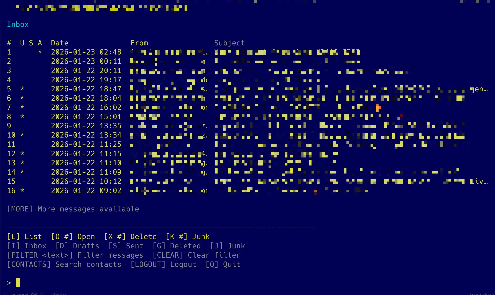

# psmail - PowerShell Console Mail Client

A draft-first console email client for **Outlook.com** and **Microsoft 365** accounts
using **Microsoft Graph API**.



## Features

- **Draft-first workflow** — all new emails are created as drafts first
- **nvim integration** — compose and edit in Neovim
- **Reply, Forward, Redraft** — with quoted text and attachment copy
- **Attachments** — upload when composing, save received files
- **Contact search** — search email history, copy address to clipboard
- **Filtering** — server-side search by sender, subject, or body across all folders
- **S/MIME** — verify incoming signatures, decrypt incoming encrypted mail, sign and encrypt outgoing mail
- **HTML cleanup** — converts HTML emails to readable plain text
- **Folder management** — Inbox, Drafts, Sent, Deleted, Junk
- **Stable viewport filling** — message lists fill exactly one screen without clearing the console
- **Local metadata only** — no local mailbox sync; only small local state/cache files

## Requirements

- **PowerShell 7+** (`pwsh`)
- **Neovim** (`nvim`) in PATH
- **Microsoft account** (Outlook.com, Hotmail.com, Microsoft 365)
- Microsoft.Graph.Authentication module (auto-installed on first run)

## Installation

```powershell
git clone https://github.com/mawirth/psmail
cd psmail
pwsh psmail.ps1
```

On first run a browser opens for Microsoft account login. Credentials are
cached by Windows WAM — subsequent starts connect automatically.

## Quick Start

```powershell
pwsh psmail.ps1          # start
pwsh psmail.ps1 -Version # show version
```

| Key | Action |
|-----|--------|
| `I` / `D` / `S` / `G` / `J` | Switch folder (Inbox / Drafts / Sent / Deleted / Junk) |
| `L` | List / refresh |
| `R <#>` | Read message |
| `M` | Load next page |
| `X <#>` | Delete (supports ranges: `X 2-5`, `X 1,3,7`) |
| `NEW` | New draft (Drafts only) |
| `E <#>` | Edit draft |
| `SEND <#>` | Send draft |
| `REPLY` / `REPLYALL` / `FORWARD` | When viewing a message |
| `FILTER <text>` | Server-side filter by sender/subject/body |
| `CLEAR` | Remove filter |
| `CONTACTS` | Search contacts |
| `SMIME` | Show S/MIME certificates |
| `LOGOUT` | Disconnect |
| `Q` | Quit |

→ Full command reference: **[docs/commands.md](docs/commands.md)**

## Message List (Inbox)

Example inbox view:

| # | U | E | S | A | Date | From | Subject |
|---|---|---|---|---|------|------|---------|
| 1 | `*` |  | `✔` | `*` | `2026-01-22 12:30` | `alice@example.com` | Signed mail |
| 27 |  | `E` |  |  | `2026-01-22 11:10` | `bob@example.com` | Encrypted |
| 103 |  |  | `~` |  | `2026-01-22 10:40` | `eve@example.com` | Untrusted sig |
| 1004 |  |  |  |  | `2026-01-22 09:00` | `carl@example.com` | Normal mail |

Column meanings:

| Column | Meaning |
|--------|---------|
| `#` | Message index |
| `U` | Unread marker (`*`) |
| `E` | Encrypted message (`E`) |
| `S` | Signing status: `✔` trusted, `~` untrusted, `✖` invalid |
| `A` | Real user attachment (`*`) |

The `#` column expands automatically when message indexes become three or four digits so the remaining columns stay aligned.

S/MIME status is verified on first open and cached locally. Pure S/MIME structure attachments are filtered out so signed or encrypted mails are not shown as normal attachments.

Encrypted and signed messages can show both markers at once: `E` for encryption and `S` for the inner signature status.

## Documentation

| Document | Contents |
|----------|----------|
| [docs/commands.md](docs/commands.md) | Full command reference, bulk ops, filtering, composition, attachments |
| [docs/smime.md](docs/smime.md) | S/MIME verification, signing, encryption, certificate setup |
| [docs/configuration.md](docs/configuration.md) | Editor, colors, footer, authentication, pagination, local state files |
| [tools/README.md](tools/README.md) | HTML footer with logo |
| [NEXTSTEPS.md](NEXTSTEPS.md) | Planned ideas and candidate scope for the next version |

## File Structure

```
psmail.ps1        # entry point
src/              # modules (config, graph, ui, drafts, smime, …)
docs/             # detailed documentation
tools/            # Create-HtmlFooter.ps1
data/             # footer.txt / footer.html (gitignored)
                  # smime-drafts.json / smime-cache.json / local helper state
attachments/      # downloaded attachments (gitignored)
cert/             # certificate files (gitignored)
```

## Troubleshooting

**Module install fails** — run PowerShell as Administrator:
```powershell
Install-Module Microsoft.Graph.Authentication -Scope CurrentUser -Force
```

**nvim not found:**
```powershell
$env:PATH += ";C:\Program Files\Neovim\bin"
```

**Authentication fails** — clear cached credentials:
```powershell
Disconnect-MgGraph
```

## Limitations

- Text-only composition (no inline HTML on send)
- No POP/IMAP, no background sync
- S/MIME encryption requires recipient certificate in Windows cert store
- AI-assisted reply suggestions are not implemented yet

## Current S/MIME Scope

- Incoming signed mail: verified and shown with trusted/untrusted/invalid status
- Incoming encrypted mail: decrypted locally if a matching private key exists
- Incoming encrypted + signed mail: both encryption and signature are indicated
- Outgoing signing/encryption: uses certificates from the Windows certificate store
- S/MIME state is cached locally for list markers; message bodies are not persisted in the cache

## License

Demonstration project for educational purposes.

---

**psmail** — simple, draft-first email for the command line.
